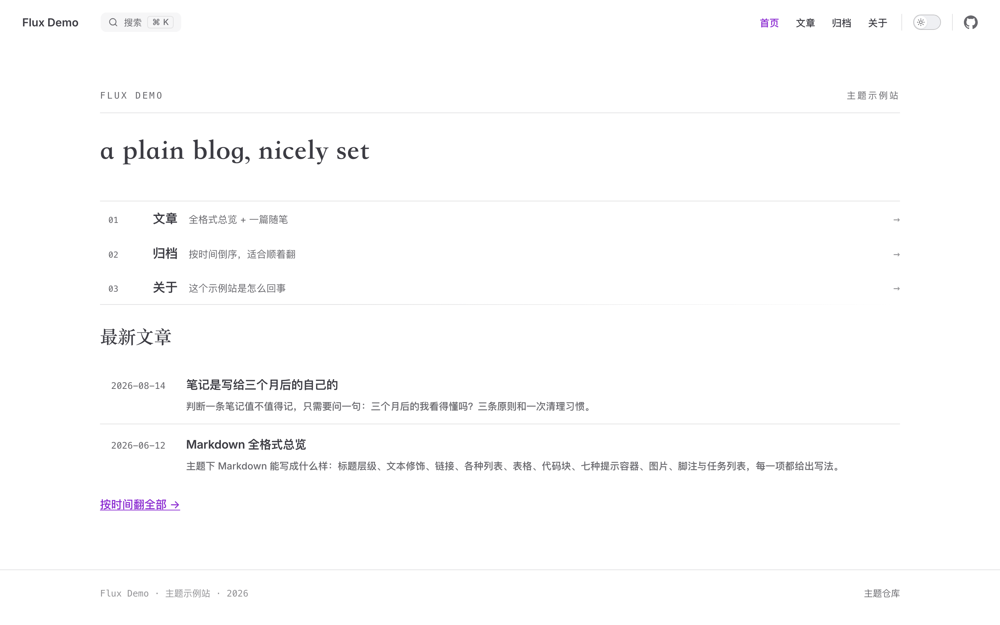
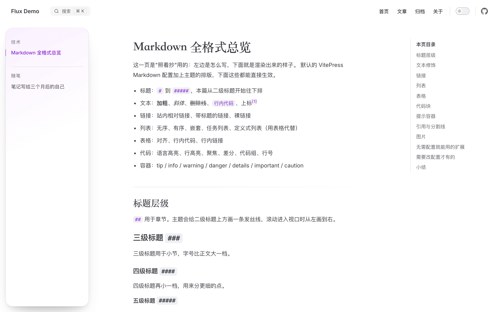
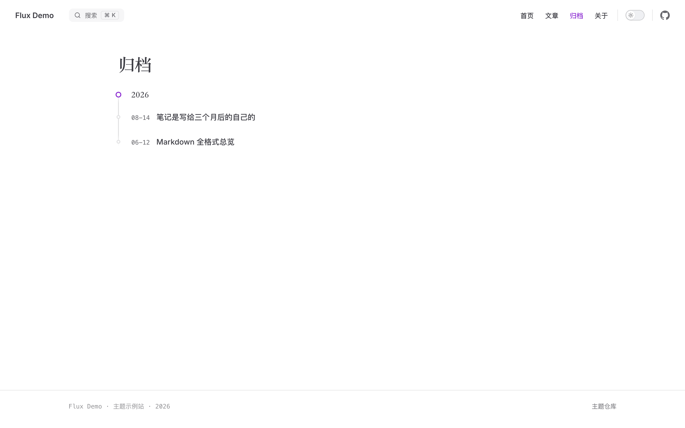

<div align="center">


<p><strong>编辑部式排版的 VitePress 主题</strong><br />
衬线字体栈 · 悬浮胶囊导航 · 滚动揭示 · 阅读进度环 · 作品版画 · 杂志化页面</p>

<p>
  <a href="https://github.com/fluxixix/vitepress-theme-fluxixix/releases"></a>
  <a href="https://github.com/fluxixix/vitepress-theme-fluxixix/actions/workflows/ci.yml"></a>
  
  
</p>

<p>
  
  
  
  
  
</p>

</div>

<p align="center">
  
</p>

<p align="center">
  
  
</p>

**它扩展默认主题，不替换它。** 没启用的页面形态一个节点都不产出，宿主自己的 CSS 天然覆盖主题——
这两条不是说法，是仓库里 `scripts/check-example-isolation.mjs` 每次 CI 都在验的断言：
把演示站的 `.vitepress/theme` 摘掉构建一遍、装回去再构建一遍，两份产物逐字比 DOM。

- 要求 VitePress `>=2.0.0-alpha.20 <3.0.0`（主题用到 VitePress 2 的 client API 与 layout 插槽）
- 纯 CSS + Vue，无预处理器、无构建产物：客户端入口直接发 TS/Vue 源码，由**你的** Vite 编译
- 不内置字体；字体栈有系统回退，不装 `@fontsource/*` 也能跑
- **不在 npm registry 上**，从 GitHub 装，git tag 就是版本（三条实测出来的坑见下面「安装」）

## 它长什么样

| 页面形态 | 做了什么 |
| --- | --- |
| 首页刊头 | 站名 + 标语 + 一行大号衬线陈述句 + 索引行，进页面时逐行落下 |
| 文章页 | 侧边栏收成悬浮玻璃卡片，右上目录跟着滚；顶部一条阅读进度线，导航栏上挂进度环 |
| 归档 / Now / 作品 / 关于 | 年份时间轴、月度快照、版画卡片、杂志化章节——都由页面的 `pageClass` 触发 |
| 全站细节 | 明暗切换是扩散而不是翻转；划词选中色、日期等宽数字、标题发丝线都在令牌层一处定义 |

上面三张图都来自仓库里的演示站 `examples/native-demo`——**一个只装主题、什么都不配的普通博客**。

## 安装

包只发 GitHub，git tag 即版本。**npm 12 起，非 registry 来源的依赖默认被拦下**
（`allow-git` / `allow-remote` 默认 `none`），所以第一次装要显式放行一次：

```bash
# npm 11 及更早：什么都不用加
npm i -D "git+https://github.com/fluxixix/vitepress-theme-fluxixix.git#v0.3.0"

# npm 12+：加 --allow-git=root（git 依赖默认被拦，报 EALLOWGIT）
npm i -D --allow-git=root "git+https://github.com/fluxixix/vitepress-theme-fluxixix.git#v0.3.0"
```

写进 `package.json`，并在项目根放一个 `.npmrc`——之后 `npm install` / `npm ci` 都不用再带 flag：

```jsonc
// package.json
"devDependencies": {
  "vitepress": "^2.0.0-alpha.20",
  "vitepress-theme-fluxixix": "git+https://github.com/fluxixix/vitepress-theme-fluxixix.git#v0.3.0"
}
```

```ini
# .npmrc —— 写 all，不要写 root。root 看着更收敛（只放行根 package.json 里声明的 git 依赖），
# 但改了 ref 之后再 install 会被它拦下：重新解析那一步 npm 走的是另一条路径，被当成
# non-root fetch（EALLOWGIT）——装得上，升不动，只能删掉 node_modules 重装。
# npm 12 的 allow-git 只有 none / root / all，没有按包名或 glob 放行的写法。
# npm 11 会把它当未知配置（一条 warning）。
allow-git=all
```

**升级**：改 `package.json` 里的 ref，然后 `npm install` 就行，不用重装依赖树。
（`allow-git=root` 下这一步会报 `EALLOWGIT`，所以上面写的是 `all`。）

<details>
<summary>没有 git 的机器 / 为什么不能用 <code>github:</code> 简写</summary>

每个 tag 都会挂一个 `npm pack` 出来的 tgz（比源码归档小得多，且严格按 `files` 过滤），
那是 **URL 依赖**，放行的是 `allow-remote`：

```bash
npm i -D --allow-remote=root "https://github.com/fluxixix/vitepress-theme-fluxixix/releases/download/v0.3.0/vitepress-theme-fluxixix-0.3.0.tgz"
```

**别写 `github:fluxixix/vitepress-theme-fluxixix` 这个简写**：它会被解析成 `git+ssh://` 并写进
lockfile，CI（没有 SSH 私钥）和没配 SSH key 的机器都会在装依赖时直接失败。一律用 `git+https://…`。

包不产构建物，所以 git 安装**不跑 `prepare`**、不装 devDependencies，装得很快；
lockfile 会把解析到的 commit 钉住，升级就是改 `#vX.Y.Z` 这个 tag。

</details>

## 接入

`.vitepress/theme/index.ts` —— 推荐写法，主题本体与样式总表一次引完，顺序由包保证：

```ts
import theme from 'vitepress-theme-fluxixix/theme'

export default theme
```

要传站点参数就得拆成两次 import，**顺序不能反**（原因见「设计决策」）：

```ts
import { fluxixixTheme } from 'vitepress-theme-fluxixix'
import 'vitepress-theme-fluxixix/styles/index.css'

export default fluxixixTheme({
  site: { name: '站名', tagline: '一句话标语' }
})
```

`.vitepress/config.ts` —— 界面文案中文化与本地搜索翻译：

```ts
import { defineConfig } from 'vitepress'
import { fluxixixSite } from 'vitepress-theme-fluxixix/site'
import { rss } from 'vitepress-theme-fluxixix/rss'

export default defineConfig({
  title: '站名',
  description: '一句话标语',
  themeConfig: fluxixixSite({
    nav: [{ text: '首页', link: '/' }]
  }),
  // 可选：构建结束后写一份 feed.xml 进产物
  buildEnd: rss({ siteUrl: 'https://example.com' })
})
```

## 站点参数

主题的默认值就是 fluxixix 本站的现值，所以第三方站点至少要覆盖站点身份——不覆盖的话，
刊头和页脚会写着别人的站名（演示站就是照下面这样配的）：

```ts
export default fluxixixTheme({
  site: { name: '站名', tagline: '一句话标语' },
  // 传了 brand 才会注入一段内联样式；不传就用 palette.css 里的默认色
  brand: { a: '#2dd4bf', b: '#38bdf8' },
  home: {
    statement: 'less is more',
    rows: [
      { num: '01', label: '文章', meta: '技术笔记', href: '/posts/' },
      { num: '02', label: '归档', meta: '按时间倒序', href: '/archive' }
    ]
  },
  footer: {
    meta: '站名 · 标语', // 缺省是「站名 · 标语 · 年份」
    links: [{ text: 'RSS', link: '/feed.xml' }]
  },
  pages: {
    postsDir: '/posts/', // 阅读进度只在哪个路径前缀下出现
    pageClasses: { about: 'about', works: 'works', nowIndex: 'now-index', nowMonth: 'now-month' }
  },
  i18n: { collapse: '收起', nowTag: 'NOW · 当下快照' }
})
```

`footer.links` 会被拼成 HTML 注入（转义后）——它与 `nav`、`sidebar` 同属站点自己的配置，信任级别一致。

## 可选的页面形态

主题里的形态都由页面自己触发，不写就不生效，一个多余节点都不会产出：

| 形态 | 触发方式 |
| --- | --- |
| 首页刊头 | 首页 frontmatter 用 `layout: home`，正文写「最新文章」列表 |
| 归档时间轴 | 页面 `pageClass: archive` + 自己按年分组的 `.archive-timeline` 结构 |
| Now 索引 / 月度留档 | `pageClass: now-index` / `now-month`，月度页 frontmatter 写 `month: YYYY-MM`、`now: true` |
| 作品墙 | `pageClass: works`，卡片用 `.work-poster` + `.poster-toggle`，版画用 `<WorkPlate />` |
| 关于页杂志化排版 | `pageClass: about`，章节用 `.about-creed` / `.skill-list` / `.ai-list` / `.about-colophon` |
| 编辑体页头 | frontmatter 写 `masthead: true`、`name`、`tag`、`meta` |

`<WorkPlate>` 已全局注册，`variant` 取 `nodes | cloud | tracks | grid | stack | pulse | blocks | frame`，
`tone` 取 `violet | cyan`。

## 字体

主题只声明字体栈，不主动引字体文件。要主题自带的那套排版时，装两个可选 peer 并加一行 import：

```bash
npm i -D @fontsource/ibm-plex-mono @fontsource/noto-serif-sc
```

```ts
import 'vitepress-theme-fluxixix/fonts' // 这一行要求上面两个包存在
import theme from 'vitepress-theme-fluxixix/theme'
```

| 用途 | 字体 | 覆盖的元素 |
| --- | --- | --- |
| 展示衬线 | `Noto Serif SC` 700 | 文章 `h1`/`h2`、首页刊头陈述句、作品名与指标、Now 页年份、编辑体页头 |
| 注释等宽 | `IBM Plex Mono` 400/500 | 代码块、日期、编号、眉题、技术栈行、页脚 |
| 正文 | VitePress 默认（`Inter` + 系统黑体） | 段落、列表、引用 |

- **思源宋体同时承接拉丁展示字**：栈里没有单独的拉丁衬线，中英混排由它一条栈完成，它缺的字再回退到系统宋体。
  早期版本自带 `Fraunces`（每页 36 KB）专门撑拉丁展示字，去掉后每页净省约 18 KB，只有拉丁字形与行盒高度略有变化。
- **宋体只引 700 一档**：给衬线元素写别的 `font-weight` 会得到浏览器合成的假字重，层级请靠字号拉开。
- 想换字体，覆盖 `--fx-font-serif` / `--vp-font-family-mono` 即可。

## 内容怎么组织

主题不强制目录结构，只有阅读进度依赖 `pages.postsDir`（默认 `/posts/`）。演示站的做法是
文章放 `posts/`、独立页面放 `pages/`，再用 `rewrites` 去掉 URL 前缀：

```ts
rewrites: { 'pages/:page': ':page', 'pages/now/:month': 'now/:month' },
srcExclude: ['**/README.md']
```

文章列表、归档与 RSS 共用一份构建期数据，用 VitePress 自己的 `createContentLoader`
（它要能解析到真实文件路径，`.data.ts` 也由 VitePress 按路径约定识别，所以不适合放进包里）：

```ts
// posts/posts.data.ts
import { createContentLoader } from 'vitepress'

export default createContentLoader('posts/**/*.md', {
  transform: (raw) =>
    raw
      .filter((page) => page.url !== '/posts/')
      .map((page) => ({
        title: page.frontmatter.title ?? page.url,
        url: page.url,
        date: page.frontmatter.date ?? '',
        description: page.frontmatter.description ?? ''
      }))
      .sort((a, b) => (a.date === b.date ? a.url.localeCompare(b.url) : a.date < b.date ? 1 : -1))
})
```

## 起一个新站

包里带一个零依赖脚手架，把 `template/` 拷成一份能直接跑的站点：

```bash
npx --allow-git=root git+https://github.com/fluxixix/vitepress-theme-fluxixix.git init my-blog
cd my-blog && npm run dev
```

生成的站点自带 `.npmrc`，进去之后的 `npm install` / `npm run dev` 不用再写 flag。
可选参数：`--name`（站名，默认取目录名）、`--tagline`、`--statement`、`--url`（RSS 用的绝对地址）、
`--ref`（依赖钉在哪个 tag，默认本包版本）、`--no-install`、`--force`。

不想用脚手架也行——`examples/native-demo` 就是一份完整演示站：

```bash
npx degit fluxixix/vitepress-theme-fluxixix/examples/native-demo my-blog
# degit 走 GitHub 的 tarball 下载，不经过 npm 的 git 策略；但它不写 package.json 里的依赖，
# 拷完照上面「安装」一节补上（并补一个 .npmrc）
```

> npx 只负责**起一个新站**，它不负责"安装主题"——主题是站点的 devDependency。

## 开发这个主题

```bash
git clone git@github.com:fluxixix/vitepress-theme-fluxixix.git
cd vitepress-theme-fluxixix
npm ci
npm ci --prefix examples/native-demo   # 演示站通过 file:../.. 链到本仓库
npm run demo:dev                       # http://localhost:5175
```

四道检查，`npm run verify` 一次跑完：

| 命令 | 把关的东西 |
| --- | --- |
| `npm run check:layers` | 主题样式未分层、`styles/index.css` 覆盖全部 17 册、产物里主题令牌排在默认主题之后 |
| `npm run check:isolation` | 摘掉主题 / 装回主题两次构建，页面 DOM 必须逐字一致（只允许多出刊头与页脚挂载点） |
| `npm run check:pack` | `npm pack` 出的 tgz 解成**真目录**再建一个最小站点，确认外部用户真的装得上 |
| `npm run demo:build` | 演示站自身能不能构建 |

`check:pack` 是这四条里最容易被忽略、也最值钱的一条：前两条都在仓库里跑，包是 `file:../..` 的
**符号链接**；而用户装下来是 `node_modules` 里的**真目录**，两者的差别恰恰会让某些问题只在别人机器上炸
（比如 config 侧的 `.ts` 入口，见「设计决策」）。它单独用一个 tgz 建站，就是为了让这种
"在我这儿好好的"的问题无处可藏。

发版：改 `package.json` 的 `version`、写进 `CHANGELOG.md`、打 `vX.Y.Z` tag。Release 工作流会跑完
上面四道检查、`npm pack`，再把 tgz 挂到 Release 上。两个工作流都不需要任何凭据，只用仓库自带的
`GITHUB_TOKEN`。

## 设计决策

**为什么扩展默认主题，而不是另起一套。** `extends: vitepress/theme` 是刻意的：主题只覆盖版式与几处交互，
组件样式尽量通过默认主题自己的 `--vp-*` 变量调整，不去跟它的状态机打架。好处是 VitePress 升级时
坏的地方少，宿主站自己的 CSS 也天然压得住主题。

**为什么主题样式不写 `@layer`。** VitePress 默认主题的 `vars.css` 与各组件 `<style scoped>` 都是
**未分层**的，而 CSS 规定「未分层的样式永远胜过任何命名层」。主题一旦把自己收进 `@layer`，
默认主题就会反过来盖住它——品牌色、悬浮导航胶囊、阅读进度环、作品卡尺寸会同时失守，**且不报任何错**。
所以主题保持未分层，靠「排在默认主题之后」取胜；这条约定由 `check:layers` 与真实渲染对比双闸把着。
要覆盖主题就照普通的后写者胜出写，想只动自己的规则就放进你自己的命名层。

**为什么直接发源码，而不是发 dist。** 纯 CSS + Vue、没有预处理器，消费者的 Vite 本来就要编译
`.vue` 与 `.ts`；发源码省掉一条构建链路，也就少一个"某天因为传递依赖构建失败"的地方。发 dist 的话
`prepare`、sourcemap、样式先后顺序都要重新安排，收益不抵成本。

**为什么 config 侧的入口是 `.js`。** `/site` 与 `/rss` 由**站点的配置文件**引入，运行时由 Node 加载；
而 Node 不对 `node_modules` 里的文件做类型剥离。入口一旦指向 `.ts`，所有真实安装的站点都会在
`vitepress build` 第一步抛 `ERR_UNSUPPORTED_NODE_MODULES_TYPE_STRIPPING`。
类型没丢：`site.d.ts` / `src/rss.d.ts` 与实现一一对应。`check:pack` 就是这条规则的哨兵。

**为什么不发 npm registry。** 版本靠 git tag + Release 表达，安装链路只有 git 一跳，也不需要 npm 账号；
代价写在「安装」一节：npm 12 起要放行一次、不能用 `github:` 简写、没装 git 的机器得走 Release 的 tgz。

## 已知边界

- **VitePress 2 alpha**：`peerDependencies` 只允许 2.x。主题用到 VitePress 2 的 `onContentUpdated`、
  `useData` 与 layout 插槽，1.x 未验证。
- **样式顺序**：用 `vitepress-theme-fluxixix/theme` 这个入口就不会踩到；自己拆成两次导入时顺序不能反。
- **`/fonts` 是可选 peer**：不用这个入口就不必装 `@fontsource/*`；引了它，这两个包就必须在依赖里。

## 谁在用它

- [fluxixix.github.io](https://fluxixix.github.io) —— 主题的"活体 demo"：首页刊头、作品墙、Now 月度留档、杂志化关于页全都用上了
- [examples/native-demo](examples/native-demo) —— 装好主题的普通博客，也是上面三张预览图的出处

## License

[MIT](LICENSE) · Copyright (c) 2026 fluxixix
